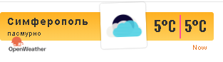
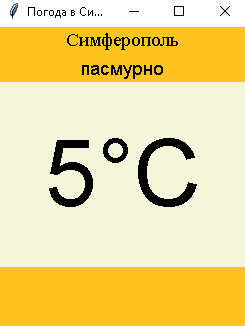

МИНИСТЕРСТВО НАУКИ  И ВЫСШЕГО ОБРАЗОВАНИЯ РОССИЙСКОЙ ФЕДЕРАЦИИ 
Федеральное государственное автономное образовательное учреждение высшего образования 
"КРЫМСКИЙ ФЕДЕРАЛЬНЫЙ УНИВЕРСИТЕТ им. В. И. ВЕРНАДСКОГО" 
ФИЗИКО-ТЕХНИЧЕСКИЙ ИНСТИТУТ 
Кафедра компьютерной инженерии и моделирования

 
<h3 align="center">Отчёт по лабораторной работе № 1  по дисциплине "Программирование"</h3>
  

студента 1 курса группы ПИ-б-о-201(2) 
Садетов Алим Асанович 
направления подготовки 09.03.04 "Программная инженерия"

  
<table>
<tr><td>Научный руководитель  старший преподаватель кафедры  компьютерной инженерии и моделирования</td>
<td>(оценка)</td>
<td>Чабанов В.В.</td>
</tr>
</table>
  

Симферополь, 2020

# Лабораторная работа №1 Погода
**Постановка задачи:** Разработать сервис предоставляющий данные о погоде в городе Симферополе на момент запроса. В качестве источника данных о погоде используется: [http://openweathermap.org/](http://openweathermap.org/). В состав сервиса входит: серверное приложение на языке С++ и клиентское приложение на языке Python.

Серверное приложение (далее Сервер) предназначенное для обслуживания клиентских приложений и минимизации количества запросов к сервису _openweathermap.org_. Сервер должен обеспечивать возможность получения данных в формате JSON.

Клиентское приложение должно иметь графический интерфейс отображающий сведения о погоде и возможность обновления данных по требованию пользователя.

**Цель работы:** 
* Закрепить навыки работы с json
* Закрепить навыки работы с многофайловыми приложениями
* Получить базовое представление о взаимодействии приложений посредством создания клиент-сервеного приложения

## Ход работы

### 1. Получение API Key
Для получения API Key я зарегистрировался на сайте [http://openweathermap.org/](http://openweathermap.org/). После регистрации в разделе API Keys воспользовался пунктом "Create Key" (рис. 1) и сгенерировал бесплатный API-ключ. **Полученный API-ключ**: **e88ae3e431bbe8ed808fd00b5faa66b7**

Рис. 1. Форма создания ключа на сайте openweathermap.org

### 2. Составление запроса для подключения погоды
В ходе лабораторной работы, был изучен формат составления запросов к сервису openweathermap.org. Были изучены примеры работы использования API на официальном сайте сервиса: [http://openweathermap.org/appid#use](http://openweathermap.org/appid#use). Наиболее удобным интерфейсом для нас является One Call API, который позволяет одним вызовом получить данные о погоде для указанного места.

В структуре ответа сервера содержится информация о почасовом прогнозе на 48 часов (рис. 2).

Необходимыми query параметрами для составления запроса являются: 
• lang=ru - язык (По условию нам необходим русский)
• lat - широта (Для Симферополя - 44.952116)
• lon - долгота (Для Симферополя - 34.102411)
• appid - API ключ

Рис. 2. Ответ openweathermap на запрос

Таким образом я составил http-запрос: http://openweathermap.org/data/2.5/onecall?id=524901&lat=44.95719&lon=34.11079&exclude=current,minutely,daily,alerts&units=metric&lang=ru&appid=9fd2c8de79d6e9abd6cbfc320884918d"

### 3. Составление запроса для получения времени
Для того чтобы получить необходимое время в Симферополе, воспользуемся сервисом [http://worldtimeapi.org/pages/schema](http://worldtimeapi.org/pages/schema). Сервис является бесплатным и не требует регистрации. Изучив примеры использования API с официального сайта, я получил запрос (рис. 4): http://worldtimeapi.org/api/timezone/Europe/Simferopol

Рис. 3. Ответ worldtimeapi на запрос

### 4. Серверное приложение
Для запуска сервера, был использован язык C++, а также сторонние библиотеки: httplib (для работы с HTTP-клиентом и HTTP-сервером), JSON for Modern C++ (позволяет работать с JSON-файлами). Если приходит запрос на "/", сервер формирует и отправляет html-виджет, если же запрос приходит на "/raw", сервер формирует и отправляет json-файл с данными о текущей температуре и состоянии погоды.
Вот исходный [[код сервера]](./c++/server/server.cpp)

	

### 5. Клиентское приложение
Создаём клиентское приложение, которое будет посылать запросы на 3000 порт localhost, обрабатывать json файл и отображать погоду на текущий момент. Приложение создаётся на python с использованием библиотеки tkinter. Вот полный исходный [[код клиентского приложения]](./python/python.py)

### 6. Графический интерфейс
Для создания графического интерфейса приложения (рис. 4) использовалась библиотека tkinter.

Рис. 5. Графический интерфейс приложения

### 7. Виджет
При подключении к "/" на сервере, программа автоматически изменяет локальный файл "widget.html" и редактирует соответствующие поля с данными о погоде, затем возвращает браузеру виджет в виде html-документа (рис. 5).

Рис. 5. Виджет

## Вывод

* Были закреплены навыки работы в json
* Были изучены способы работы с api
* Были получены базовые знания о взаимодействии приложений