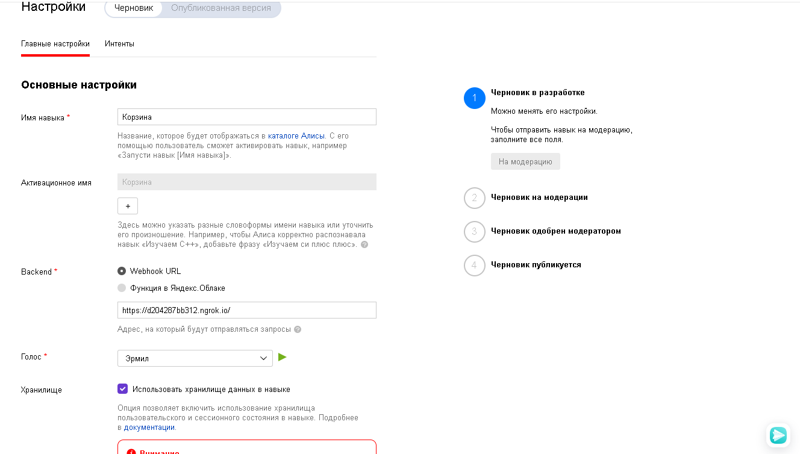

<p align="center">МИНИСТЕРСТВО НАУКИ  И ВЫСШЕГО ОБРАЗОВАНИЯ РОССИЙСКОЙ ФЕДЕРАЦИИ<br>
Федеральное государственное автономное образовательное учреждение высшего образования<br>
"КРЫМСКИЙ ФЕДЕРАЛЬНЫЙ УНИВЕРСИТЕТ им. В. И. ВЕРНАДСКОГО"<br>
ФИЗИКО-ТЕХНИЧЕСКИЙ ИНСТИТУТ<br>
Кафедра компьютерной инженерии и моделирования</p>
<br>
<h3 align="center">Отчёт по лабораторной работе № 2<br> по дисциплине "Программирование"</h3>
<br><br>
<p>студента 1 курса группы ПИ-б-о-201(2)<br>
Садетов Алим Асанович<br>
направления подготовки 09.03.04 "Программная инженерия"</p>
<br><br>
<table>
<tr><td>Научный руководитель<br> старший преподаватель кафедры<br> компьютерной инженерии и моделирования</td>
<td>(оценка)</td>
<td>Чабанов В.В.</td>
</tr>
</table>
<br><br>
<p align="center">Симферополь, 2021</p>
<hr>

# Лабораторная работа №2 Алиса
**Постановка задачи:**
1.  Разработать и зарегистрировать навык для Алисы на сервисе Яндекс.Диалоги;
2.  В качестве backend-a для навыка реализовать приложение на языке С++ выполняющее следующие функции:
    1.  Составление продуктовой корзины:
        -   Добавление продукта в корзину;
        -   Удаление продукта из корзины;
        -   Очистка корзины;
        -   Вывод списка товаров в корзине;
        -   Подсчёт стоимости товаров в корзине.
    2.  Вывод справочной информации по навыку;
    3.  Регистрацию webhook-ов сторонних сервисов;
    4.  Отправку данных на сторонние сервисы.
3.  В качестве стороннего сервиса реализовать приложение на языке Python выполняющее следующие функции:
    1.  Ожидание данных о покупке;
    2.  Сохранение поступивших данных в excel-документ.


**Цель работы:** 
1.  Получить представления о структуре post-запроса;
2.  Изучить webhooks как метод взаимодействия web-приложений;

## Ход работы

### 1. Настройка
На главной странице нажал кнопку Консоль, после чего попал на страницу dashboard со всеми созданными навыками. Затем нажал кнопку "Создать диалог", а далее "Навык в Алисе" и попал на страницу настройки навыка; Далее заполнил поля формы (рис. 1 и рис.2) в соответствии с документацией и опубликовал настройки диалога.


Рис. 1. Страница настроек навыка


Рис. 2. Продолжение настроек навыка
### 2. Корзина
Корзина использует сессионные данные для хранения выбранных пользователем названий и цен товаров. Функция "Очистить корзину" очищает поле "check" в данных сессии, команда "Добавить в корзину" добавляет в корзину название и его цену, "Удалить из корзины" -  убирает из корзины указанный объект, "Что в корзине" - выводит все товары в формате: Название и цена, "Сумма" - сообщает суммарную стоимость всех товаров пользователю (рис. 3).


Рис. 3. Демонстрация функционала функции "Корзина"
### 3. Помощь
Если пользователь нажал кнопку "помощь", то режим навыка переключается в режим помощи, а затем перечисляются всевозможные навыки и их краткое описание. Для того чтобы отобразить детальную справку по команде, необходимо ввести необходимую команду или нажать на соответствующую ей кнопку (рис. 4).


Рис. 4. Демонстрация функционала функции "Помощь"
### 4. Управление списком WebHook-служб
При подключении к "/webhooks" на сервере, программа автоматически изменяет локальный файл "template.html" и редактирует соответствующие поля с блоками URL-адресов, подставляя в каждый из них информацию из файла "block.html", а затем возвращает браузеру html-документ (рис. 5). При добавлении или удалении соответствующего WebHook-а, браузер посылает POST-запрос на тот же URN серверу. Затем серверное приложение обрабатывает запрос и совершает необходимое действие.


Рис. 5. Страница управления webhook-ами
### 5. Заполнение Excel-файла
Для работы с Excel-документом клиентское приложение использует модуль Openpyxl для Python. Клиент получает с помощью модуля Flask json-строку с сервера C++. Затем происходит запись данных в буфер, также записывается дата отправки запроса. Буфер очищается, когда количество записей достигнет тысячи, а затем записывается в Excel документ.
Ссылка на Excel документ: [./excel/data.xlsx](./excel/data.xlsx)
### 6. Клиентское приложение
Для создания клиентского приложения использовался язык Python, весь исходный код хранится в одном файле. Использовались библиотеки Openpyxl и Flask. Приложение ждет запроса сервера и получает от него данные корзины пользователя. Исходный код приложения:

<details>

		from flask import Flask, request, jsonify

		from datetime import datetime

		import openpyxl

		from openpyxl.styles import Alignment, PatternFill, Font, Border, Side

		BUFFER_SIZE = 1
		buf = []

		def table(sheet):
			sheet.column_dimensions['A'].width = 8
			sheet.column_dimensions['B'].width = 70
			sheet.column_dimensions['C'].width = 27
			sheet.column_dimensions['D'].width = 32
			sheet.column_dimensions['E'].width = 12
			sheet['A1'] = "N"
			sheet['B1'] = "User ID"
			sheet['C1'] = "Datetime"
			sheet['D1'] = "Item"
			sheet['E1'] = "Prise"
			for i in range(5):
				sheet[1][i].fill = PatternFill(start_color='F0F8F8F8',
		                   end_color='F0F8F8F8',
		                   fill_type='solid')
				sheet[1][i].alignment = Alignment(horizontal='center', vertical='center')
				sheet[1][i].font = Font(bold=True)
			return sheet

		def getid(sheet):
			i = 2
			bstyle = Border(left=Side(style='thin'), 
		                     right=Side(style='thin'), 
		                     top=Side(style='thin'), 
		                     bottom=Side(style='thin'))
			while sheet[i][3].border == bstyle:
				i += 1
			return i


		def mainstyle(sheet, y, x):
			bstyle = Border(left=Side(style='thin'), 
		                     right=Side(style='thin'), 
		                     top=Side(style='thin'), 
		                     bottom=Side(style='thin'))
			for iy in range (1, y):
				for ix in range (0, x):
					sheet[iy][ix].border = bstyle
					sheet[iy][ix].alignment = Alignment(horizontal='center', vertical='center')
			return sheet

		def previd(sheet, y):
			i = y-1
			while (i > 1) and (sheet[i][0].value is None):
				i -= 1
			if i <= 1:
				return 1
			else:
				return sheet[i][0].value+1

		def jsonsave(sheet):
			y = getid(sheet)
			for i in range(len(buf)):
				sheet[y][0].value = 1 if y <= 1 else previd(sheet, y) 
				sheet[y][1].value = buf[i]["user_id"]
				sheet[y][2].value = buf[i]["datetime"]
				oldy = y
				try:
					for item in buf[i]["check"]:
						sheet[y][3].value = item["item"]
						sheet[y][4].value = item["price"]
						y += 1
				except:
					y += 1
				sheet.merge_cells(start_row=oldy, start_column=1, end_row=y-1, end_column=1)
				sheet.merge_cells(start_row=oldy, start_column=2, end_row=y-1, end_column=2)
				sheet.merge_cells(start_row=oldy, start_column=3, end_row=y-1, end_column=3)
			sheet = mainstyle(sheet, y, 5)
			return sheet

		def buffer():
			global buf
			try:
				book = openpyxl.open("data.xlsx", read_only=False)
			except:
				book = openpyxl.Workbook()
			sheet = book.active
			if sheet['A1'].value is None:
				sheet = table(sheet)
			sheet = jsonsave(sheet)
			book.save("data.xlsx")


		def writeinfo(content):
			global buf
			buf.append(content);
			buf[-1]["datetime"] = datetime.now().strftime("%d/%m/%Y %H:%M:%S")
			if len(buf) >= BUFFER_SIZE:
				buffer()
				buf = []


		app = Flask(__name__)
		 

		 
		@app.route('/', methods=['POST', 'GET'])
		def index():
			if request.is_json:
				content = request.get_json()
				writeinfo(content)
				return 'OK'
		 
		if __name__ == "__main__":
			app.run()
</details>
### 7. Серверное приложение
Для запуска сервера, был использован язык C++, а также сторонние библиотеки: httplib (для работы с HTTP-клиентом и HTTP-сервером), JSON for Modern C++ (позволяет работать с JSON-файлами). Если приходит запрос на "/webhooks", сервер формирует и отправляет html-страницу со список webhook-ов, если же запрос приходит на "/", сервер формирует и отправляет json-файл с ответными данными на Яндекс.Диалоги. Исходный код приложения:

**C++.cpp**
<details>
	```c++
	#include <iostream>
	#include <vector>
	#include <iomanip>
	#include <cpp_httplib/httplib.h>
	#include <nlohmann/json.hpp>
	#include "WebHook.h"
	#include "Dialogs.h"

	using namespace httplib;
	using std::string;
	using json = nlohmann::json;

	TAlice Alice;

	string replace_str(string str, string source, string nw) {
		SIZE_T sbegin = str.find(source);
		return str.replace(sbegin, source.length(), nw);
	}

	string readFile(string filename) {
		std::ifstream is(filename);
		std::stringstream ss;
		ss << is.rdbuf();
		return ss.str();
	}

	void process_post(const Request& req, Response& res) {
		if (req.method != "POST")
			return;

		if (req.has_param("del")) {
			string val = req.get_param_value("del");
			int id = wh.Search(val);
			if (id >= 0)
				wh.Erase(id);
		}
		if  (req.has_param("set")) {
			string val = req.get_param_value("set");
			wh.PushBack(val);
		}
		res.set_redirect("#");
	}

	void wh_response(const Request& req, Response& res) {
		string block_original = readFile("block.html");
		string blocks = "";
		for (int i = 0; i < wh.Size(); i++) {
			string block_temp = block_original;
			block_temp = replace_str(block_temp, "Webhook URL", wh.Get(i));
			block_temp = replace_str(block_temp, "Webhook URL", wh.Get(i));
			blocks += block_temp+"\n";
		}
		string templ = readFile("template.html");
		templ = replace_str(templ, "{webhooks_list}", blocks);
		process_post(req, res);
		res.set_content(templ, "text/html");
	}

	void dialog_response(const Request& req, Response& res) {
		string body = req.body.c_str();
		string aresp = Alice.GetResponse(body);
		res.set_content(aresp, "text/plain");
	}

	int main()
	{
		Server svr;   
		svr.Post("/", dialog_response);
		svr.Get("/webhooks", wh_response);
		svr.Post("/webhooks", wh_response);
		std::cout << "Start server... OK\n";
		svr.listen("127.0.0.1", 1234);
	}
	```
</details>
**Dialogs.h**
<details>
	#pragma once


	#include "WebHook.h"


	using namespace httplib;
	using std::string;
	using json = nlohmann::json;


	class TAlice {
	public:
		string GetWordFromTokens(json tokens, unsigned int id);
		string GetWordsFromTokens(json tokens, unsigned int beginid, unsigned int endid);
		string GetResponse(string body);
		string GetResponseMain(string body, json j, json tokens, json state);
		string GetResponseHelp(string body, json j, json tokens, json state, bool start = false);
		json CreateButtonsMain(json state);
		json CreateButtonsHelp(json state);
		void EraseFromCart(json &state, string name);
		string GetCart(json state);
		string GetCartSum(json state);
		string CreateResponse(string s, json state, json buttons, bool end_session = false);
		TAlice();
	};

	string TAlice::CreateResponse(string s, json state, json buttons, bool end_session) {
		json j;
		j["response"]["text"] = s;
		if (state["canSpeak"])
			j["response"]["tts"] = s;
		j["response"]["buttons"] = buttons;
		j["response"]["end_session"] = end_session;
		j["version"] = "1.0";
		j["session_state"] = state;
		std::stringstream ss;
		ss << std::setw(2) << j << std::endl;
		return ss.str();
	}


	string TAlice::GetWordFromTokens(json tokens, unsigned int id) {
		if (id < tokens.size()) {
			string s = tokens[id];
			return s;
		}
		return "";
	}

	string TAlice::GetWordsFromTokens(json tokens, unsigned int beginid, unsigned int endid) {
		string rez = "";
		for (int i = beginid; i <= endid; i++) {
			rez += GetWordFromTokens(tokens, i);
			if (i != endid) rez += " ";
		}
		return rez;
	}

	json TAlice::CreateButtonsMain(json state) {
		json buttons = json::array();
		if (state["canSpeak"]) {
			buttons[0]["title"] = u8"Молчать";
		} else {
			buttons[0]["title"] = u8"Говорить";
		}
		buttons[1]["title"] = u8"Помощь";
		return buttons;
	}

	json TAlice::CreateButtonsHelp(json state) {
		json buttons = json::array();
		buttons[0]["title"] = u8"Молчать";
		buttons[1]["title"] = u8"Говорить";
		buttons[2]["title"] = u8"Помощь";
		buttons[3]["title"] = u8"Очистить корзину";
		buttons[4]["title"] = u8"Добавить в корзину";
		buttons[5]["title"] = u8"Удалить из корзины";
		buttons[6]["title"] = u8"Что в корзине";
		buttons[7]["title"] = u8"Сумма";
		buttons[8]["title"] = u8"Покупка завершена";
		buttons[9]["title"] = u8"ВЫХОД ИЗ СПРАВКИ";
		return buttons;
	}

	void TAlice::EraseFromCart(json &state, string name) {
		for (int i = 0; i < state["check"].size(); i++) {
			if (state["check"][i]["item"] == name) {
				state["check"].erase(i);
				return;
			}
		}
	}

	string TAlice::GetCart(json state) {
		if (state["check"].size() <= 0) {
			return u8"Корзина пуста";
		}
		string rez = "";
		for (int i = 0; i < state["check"].size(); i++) {
			string name = state["check"][i]["item"];
			int price = state["check"][i]["price"];
			string temp;
			temp = name + u8" " + std::to_string(price);
			temp = temp + u8" рублей\n";
			rez += temp;
		}
		rez.pop_back(); //remove last return
		return rez;
	}

	string TAlice::GetCartSum(json state) {
		int total = 0;
		for (int i = 0; i < state["check"].size(); i++) {
			total += state["check"][i]["price"];
		}
		return u8"Суммарная стоимость: " + std::to_string(total);
	}

	string TAlice::GetResponseMain(string body, json j, json tokens, json state) {
		if (j["session"]["new"]) {
			state["canSpeak"] = true;
			state["check"] = {};
			state["mode"] = "main";
		}

		string rez = "";
		json buttons = CreateButtonsMain(state);

		if (j["session"]["new"]) {
			rez = u8"Здравствуйте! Я помогу вам с покупками.";
			return CreateResponse(rez, state, buttons);
		}
		if (GetWordFromTokens(tokens, 0) == u8"молчать") {
			state["canSpeak"] = false;
			json buttons = CreateButtonsMain(state);
			rez = u8"Молчу, молчу";
			return CreateResponse(rez, state, buttons);
		}
		if (GetWordFromTokens(tokens, 0) == u8"говорить") {
			state["canSpeak"] = true;
			json buttons = CreateButtonsMain(state);
			rez = u8"Хорошо";
			return CreateResponse(rez, state, buttons);
		}
		if (GetWordFromTokens(tokens, 0) == u8"помощь") {
			state["mode"] = u8"help";
			return GetResponseHelp(body, j, tokens, state, true);
		}
		if (GetWordsFromTokens(tokens, 0, 1) == u8"очистить корзину")  {
			state["check"] = {};
			rez = u8"Корзина пуста";
			return CreateResponse(rez, state, buttons);
		}
		if (GetWordsFromTokens(tokens, 0, 2) == u8"добавить в корзину") {
			string name = GetWordFromTokens(tokens, 3);
			int price = std::stoi(GetWordFromTokens(tokens, 4));
			state["check"].push_back({ {"item", name}, {"price", price} });
			rez = u8"ОК";
			return CreateResponse(rez, state, buttons);
		}
		if (GetWordsFromTokens(tokens, 0, 2) == u8"удалить из корзины") {
			string name = GetWordFromTokens(tokens, 3);
			EraseFromCart(state, name);
			rez = u8"ОК";
			return CreateResponse(rez, state, buttons);
		}
		if (GetWordsFromTokens(tokens, 0, 2) == u8"что в корзине") {
			rez = GetCart(state);
			return CreateResponse(rez, state, buttons);
		}
		if (GetWordFromTokens(tokens, 0) == u8"сумма") {
			rez = GetCartSum(state);
			return CreateResponse(rez, state, buttons);
		}
		if (GetWordsFromTokens(tokens, 0, 1) == u8"покупка завершена") {
			wh.SendToAll(state["check"], j["session"]["user"]["user_id"]);
			return CreateResponse(u8"Заходите еще", state, buttons, true);
		}
		if (/* COMMAND UNKNOWN */1) {
			rez = u8"Неизвестная команда";
			return CreateResponse(rez, state, buttons);
		}
	}

	string TAlice::GetResponseHelp(string body, json j, json tokens, json state, bool start) {
		string rez;
		json buttons = CreateButtonsHelp(state);
		if (start) {
			rez = u8"Корзина. Поможет организовать покупки.\nПомощь. Поможет разобраться с командами навыка\nМолчать/говорить.\
	Поможет настроить озвучивание сообщений\nО чём рассказать подробнее?";
			return CreateResponse(rez, state, buttons);
		}
		if (GetWordFromTokens(tokens, 0) == u8"молчать") {
			rez = u8"Все последующие сообщения после выполнения команды в пределах сессии выводятся без озвучивания";
			rez += u8"\nО чём ещё рассказать?";
			return CreateResponse(rez, state, buttons);
		}
		if (GetWordFromTokens(tokens, 0) == u8"говорить") {
			rez = u8"Все последующие сообщения после выполнения команды в пределах сессии озвучиваются";
			rez += u8"\nО чём ещё рассказать?";
			return CreateResponse(rez, state, buttons);
		}
		if (GetWordFromTokens(tokens, 0) == u8"помощь") {
			rez = u8"Режим работы навыка переключается в режим помощи";
			rez += u8"\nО чём ещё рассказать?";
			return CreateResponse(rez, state, buttons);
		}
		if (GetWordsFromTokens(tokens, 0, 1) == u8"очистить корзину")
		{
			rez = u8"ОЧИСТИТЬ КОРЗИНУ [название]\nПолная очистка корзины. После выполнения команды все элементы корзины будут безвозвратно удалены";
			rez += u8"\nО чём ещё рассказать?";
			return CreateResponse(rez, state, buttons);
		}
		if (GetWordsFromTokens(tokens, 0, 2) == u8"добавить в корзину") {
			rez = u8"ДОБАВИТЬ В КОРЗИНУ [название, цена]\nВ корзину добавляется новый товар, указывается его цена и наименование. Цена товара - это целые рубли";
			rez += u8"\nО чём ещё рассказать?";
			return CreateResponse(rez, state, buttons);
		}
		if (GetWordsFromTokens(tokens, 0, 2) == u8"удалить из корзины") {
			rez = u8"УДАЛИТЬ ИЗ КОРЗИНЫ [название]\nБезвозвратно удаляет товар из корзины по названию товара";
			rez += u8"\nО чём ещё рассказать?";
			return CreateResponse(rez, state, buttons);
		}
		if (GetWordsFromTokens(tokens, 0, 2) == u8"что в корзине") {
			rez = u8"Перечисляет все товары в произвольном порядке в формате: Название и цена";
			rez += u8"\nО чём ещё рассказать?";
			return CreateResponse(rez, state, buttons);
		}
		if (GetWordFromTokens(tokens, 0) == u8"сумма") {
			rez = u8"Сообщает пользователю суммарную стоимость товаров в корзине";
			rez += u8"\nО чём ещё рассказать?";
			return CreateResponse(rez, state, buttons);
		}
		if (GetWordsFromTokens(tokens, 0, 1) == u8"покупка завершена") {
			rez = u8"Завершает оформление покупок и закрывает пользовательскую сессию";
			rez += u8"\nО чём ещё рассказать?";
			return CreateResponse(rez, state, buttons);
		}
		if (GetWordsFromTokens(tokens, 0, 2) == u8"выход из справки") {
			state["mode"] = u8"main";
			rez = u8"Обращайся ещё";
			return CreateResponse(rez, state, CreateButtonsMain(state));
		}
		if (/* COMMAND UNKNOWN */1) {
			rez = u8"Неизвестная команда";
			return CreateResponse(rez, state, buttons);
		}
	}

	string TAlice::GetResponse(string body) {
		json j = json::parse(body);
		json tokens = j["request"]["nlu"]["tokens"];
		json state = j["state"]["session"];
		string mode;

		try {
			mode = state["mode"];
		} catch (...) {
			mode = u8"main";
		}
		
		/* Main response */
		if (mode == u8"main") {
			return GetResponseMain(body, j, tokens, state);
		}
		if (mode == u8"help") {
			return GetResponseHelp(body, j, tokens, state);
		}

		string rez = "Недействительная сессия";
		return CreateResponse(rez, state, "{}");
	}

	TAlice::TAlice() {
		//DO NOTHING
	}
</details>

**WebHook.h**

<details>
	#pragma once


	using namespace httplib;
	using std::string;
	using json = nlohmann::json;


	typedef std::vector<string> webhdata;


	class WebHook {
	public:
		void SendToAll(json state, string user_id);
		int Size();
		int Search(string val);
		string GetJSON();
		void Erase(unsigned int id);
		string Get(unsigned int id);
		void PushBack(string val);
		void SaveToFile();
		bool LoadFromFile();
		webhdata data;
		WebHook();
	private:
		const string filename = "webhooks.json";
		const string field = "WebHooks";
	};

	WebHook wh;

	void WebHook::SendToAll(json state, string user_id) {
		json fulljson;
		fulljson["user_id"] = user_id;
		fulljson["check"] = state;
		for (int i = 0; i < this->data.size(); i++) {
			string url = this->data.at(i);
			Client cli(url.c_str());
			std::cout << "Post data: " << fulljson << "\n";
			std::cout << "Sending state to " + url + "...";
			std::stringstream ss;
			ss << fulljson;
			//string strstate = "({\"json\": \"" + ss.str() + "\"})";
			auto res = cli.Post("/", ss.str(), "application/json");
			if (res) {
				if (res->status == 200) {
					std::cout << " [OK]\n";
				} else {
					std::cout << " [FAIL]\nStatus code: " << res->status << std::endl;
				}
			} else {
				std::cout << "[FAIL]\nError code: " << res.error() << std::endl;
			}
		}
	}

	int WebHook::Size() {
		return this->data.size();
	}

	int WebHook::Search(string val) {
		for (int i = 0; i < this->data.size(); i++) {
			if (this->data.at(i) == val) {
				return i;
			}
		}
		return -1;
	}

	string WebHook::GetJSON() {
		json j;
		j["WebHooks"] = json::array();
		for (int i = 0; i < this->data.size(); i++) {
			j["WebHooks"].push_back(this->data[i]);
		}
		std::stringstream ss;
		ss << std::setw(2) << j;
		return ss.str();
	}

	void WebHook::Erase(unsigned int id) {
		this->data.erase(this->data.begin() + id);
		this->SaveToFile();
	}

	string WebHook::Get(unsigned int id) {
		return this->data.at(id);
	}

	void WebHook::PushBack(string val) {
		this->data.push_back(val);
		this->SaveToFile();
	}

	void WebHook::SaveToFile() {
		std::ofstream os(this->filename);
		os << this->GetJSON() << std::endl;
		os.close();
	}

	bool WebHook::LoadFromFile() {
		std::ifstream is(this->filename);
		if (is) {
			json j = json::parse(is);
			for (int i = 0; i < j["WebHooks"].size(); i++) {
				this->data.push_back(j["WebHooks"][i]);
			}
			return true;
		}
		else {
			return false;
		}
		is.close();
	}

	WebHook::WebHook() {
		if (!this->LoadFromFile()) {
			this->SaveToFile();
		}
	}
</details>

## Вывод

Получил основные представления о структуре post-запроса, изучил webhooks как метод взаимодействия web-приложений и реализовал посредством функций обратных вызовов взаимодействие клиента и сервера.
