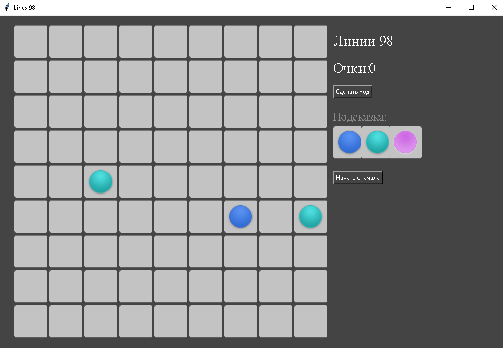
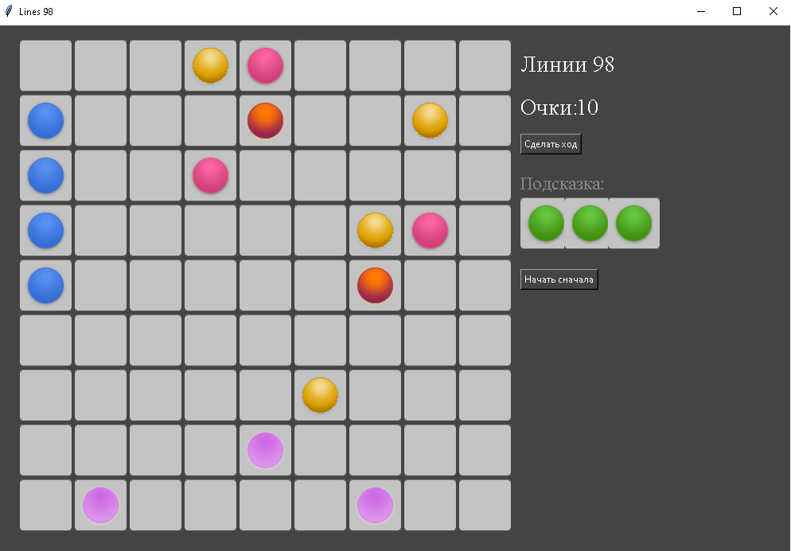
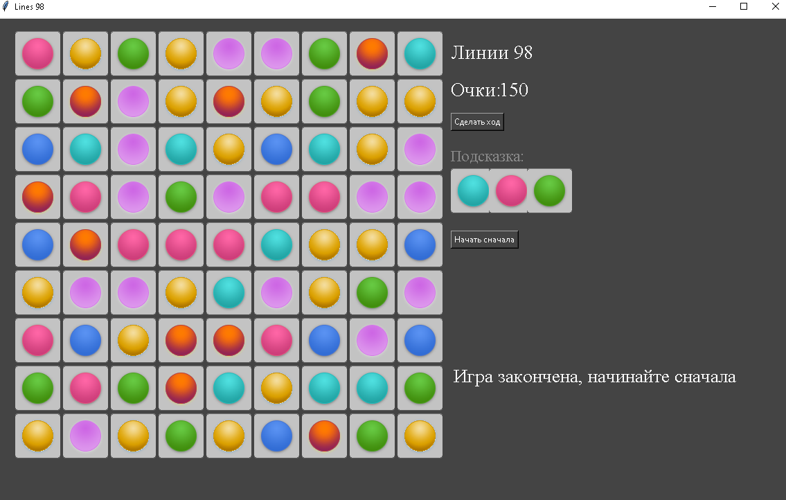

МИНИСТЕРСТВО НАУКИ  И ВЫСШЕГО ОБРАЗОВАНИЯ РОССИЙСКОЙ ФЕДЕРАЦИИ 
Федеральное государственное автономное образовательное учреждение высшего образования 
"КРЫМСКИЙ ФЕДЕРАЛЬНЫЙ УНИВЕРСИТЕТ им. В. И. ВЕРНАДСКОГО" 
ФИЗИКО-ТЕХНИЧЕСКИЙ ИНСТИТУТ 
Кафедра компьютерной инженерии и моделирования

 
<h3 align="center">Отчёт по лабораторной работе № 3  по дисциплине "Программирование"</h3>
  

студента 1 курса группы ПИ-б-о-201(2) Садетова Алима Асановича 
направления подготовки 09.03.04 "Программная инженерия"

  
<table>
<tr><td>Научный руководитель  старший преподаватель кафедры  компьютерной инженерии и моделирования</td>
<td>(оценка)</td>
<td>Чабанов В.В.</td>
</tr>
</table>
  

Симферополь, 2021

## Цель
1. Закрепить навыки разработки программ с простым графическим интерфейсом пользователя на языке Python при помощи библиотеки Tkinter;
2. Получить представление о разработке простых игровых приложений.

## Постановка задачи

1. Используя стандартный модуль для разработки программ с графическим интерфейсом Tkinter реализуйте игру Lines 98 на зыке Python.
2. В качестве образца графического интерфейса используйте данную игру: http://game-shariki.ru/linii-2.

## Выполнение работы

Сперва было создан один объект Canvas, помещённый в корневой frame, на котором и производятся все изменения.

Каждая клетка являвется экземпляром класса, который хранит размер, цвет, выбрана ли клетка и id объекта на canvas.
У каждого объекта есть функция, которая для неё генерирует новую картинку на основе полей экземпляра и
заменяет картинку на Canvas по уникальному id объекта.

Далее были реализованы надписи справа:
- кнопки "сделать ход" и "начать сначала"
- название игры
- подсказка
- счёт

Для счёта запоминался id текста, который должен содержать текущий счёт (целое число) и по этому id изменялся счёт через функцию update_score().

Так же была создана функция генерации трёх случайных шариков, они попадают в поле "подсказки", а также функция собственно помещения шариков на поле.

Кнопка "сделать ход" размещает шары из подсказки и генерирует новую.

Кнопка "начать сначала" убирает все шары с поля, обнуляет счёт, меняет посказку.

В игре также реализован алгоритм BFS (поиска в ширину), для поиска пути для шарика.

После каждого хода делается проверка на 5 и более одинаковых шариков в ряд, столбец и диагональ, и за каждый удалённый шарик добавляется по 2 очка.
Это реализованно через массивы из массивов из ссылок на клетки игрового поля по вертикали, горизонтали и диагонали.

Скриншоты игрового процесса:

Рисунок 1. Игра "Линии 98" после открытия

Рисунок 2. Игра после удаления 5 шаров в ряд (счёт поменялся)

Рисунок 3. Заполненное поле (конец игры)

Исходный код:

    import random

    from tkinter import Tk, Button, Canvas, NW, W, TclError, Label

    from PIL import Image, ImageTk

    root = Tk()
    root.geometry('1000x666')
    root.title("Lines 98")
    _assets = {}
    assets = {}
    ball_by_index = []
    endgame = False

    class viz:
        uniqid: int = -1
        image: Image
        imagetk: ImageTk.PhotoImage
        color: int = -1
        variant: int = -1
        dark: bool = True
        stolbec: int = -1
        col: int = -1
        def update_cell(self):
            if self.variant != -1:
                self.image = Image.new("RGBA", _assets['cell_dark'].size)
                self.image.paste(_assets[f'{ball_by_index[self.color]}_{self.variant}'], (5, 5))
                if self.dark:
                    self.image = Image.alpha_composite(_assets['cell_dark'], self.image)
                else:
                    self.image = Image.alpha_composite(_assets['cell_light'], self.image)
                self.imagetk = ImageTk.PhotoImage(self.image)
            else:
                if self.dark:
                    self.imagetk = assets['cell_dark']
                else:
                    self.imagetk = assets['cell_light']
            canvas.itemconfigure(self.uniqid, image=self.imagetk)
    CellMatrix, FreeCells, cm_rows, cm_columns, cm_diags,cm_rdiags = [], [], [], [], [], []
    HintItems = [viz(), viz(), viz()]

    N, M, gap, global_padding = 9, 9, 4, 20

    ProcessClicks: bool = True
    SelectedCell: viz = None

    def load_assets():
        global _assets, assets, ball_by_index
        _assets.update({
            "cell" : Image.open("cell-bgr.png").convert('RGBA'),
        })
        _assets.update({
            "cell_dark" : _assets["cell"].crop( (2, 1, 67, 66) ),
            "cell_light" : _assets["cell"].crop( (2, 70, 67, 135) ),
        })
        _assets_balls = {
            "pink"   : Image.open("ball-pink.png").convert('RGBA'),
            "red"    : Image.open("ball-red.png").convert('RGBA'),
            "yellow" : Image.open("ball-yellow.png").convert('RGBA'),  
            "green"  : Image.open("ball-green.png").convert('RGBA'),
            "aqua"   : Image.open("ball-aqua.png").convert('RGBA'),
            "blue"   : Image.open("ball-blue.png").convert('RGBA'),
            "violet" : Image.open("ball-violet.png").convert('RGBA'),
        }
        for k, v in _assets_balls.items():
            for i in range(7):
                _assets[f"{k}_{i}"] = v.crop( (0, i*60, 55, i*60 + 55) )

        ball_by_index = [ "pink", "red", "yellow", "green", "aqua", "blue", "violet" ]
        for k, v in _assets.items():
            assets[k] = ImageTk.PhotoImage(v)

    def create_cells():
        global CellMatrix, cm_columns, cm_rows
        for stolbec in range(N):
            CellMatrix.append(list())
            cm_columns.append(list())
            for col in range(M):
                cell = viz()
                cell.imagetk = assets['cell_dark']
                cell.stolbec = stolbec
                cell.col = col
                CellMatrix[stolbec].append(cell)
                FreeCells.append(cell)
                cm_columns[stolbec].append(cell)
        
        for col in range(M):
            cm_rows.append(list())
            for stolbec in range(N):
                cm_rows[col].append(CellMatrix[stolbec][col])
        
        if N > M:
            j = 0
            for shift in range(N-4):
                cm_diags.append(list())
                cm_rdiags.append(list())
                for i in range(M-shift):
                    cm_diags[j].append(CellMatrix[i+shift][i])
                    cm_rdiags[j].append(CellMatrix[M-i-shift-1][i])
                j += 1
            for shift in range(1, M-4):
                cm_diags.append(list())
                cm_rdiags.append(list())
                for i in range(N-shift):
                    cm_diags[j].append(CellMatrix[i][i+shift])
                    cm_rdiags[j].append(CellMatrix[M-i-1][i+shift])
                j += 1
        else:
            j = 0
            for shift in range(M-4):
                cm_diags.append(list())
                cm_rdiags.append(list())
                for i in range(N-shift):
                    cm_diags[j].append(CellMatrix[i+shift][i])
                    cm_rdiags[j].append(CellMatrix[N-i-shift-1][i])
                j += 1
            for shift in range(1, N-4):
                cm_diags.append(list())
                cm_rdiags.append(list())
                for i in range(M-shift):
                    cm_diags[j].append(CellMatrix[i][i+shift])
                    cm_rdiags[j].append(CellMatrix[N-i-1][i+shift])
                j += 1

    def place_cells(canvas):
        global CellMatrix
        for stolbec in range(len(CellMatrix)):
            for col in range(len(CellMatrix[0])):
                cell = canvas.create_image(
                    10 + global_padding + gap*stolbec + CellMatrix[stolbec][col].imagetk.width()*stolbec,
                    global_padding + gap*col + CellMatrix[stolbec][col].imagetk.height()*col,
                    image=CellMatrix[stolbec][col].imagetk,
                    anchor=NW
                )
                canvas.tag_bind(cell, '<Button-1>', lambda event, thisrow=stolbec, thiscol=col: cell_click(event, thisrow, thiscol))
                CellMatrix[stolbec][col].uniqid = cell
        
    def create_info(canvas):
        global score, varscore, HintItems
        xposition = global_padding + 639
        yposition = global_padding + 30
        canvas.create_text(
            xposition,
            yposition,
            text="Линии 98", font=("Times New Roman", 22), fill="white",
            anchor=W)
        yposition += 51 - 13
        canvas.create_text(
            xposition,
            yposition,
            text="Очки: ", font=("Times New Roman", 22), fill="white",
            anchor=NW)
        varscore = 0
        score = canvas.create_text(
            xposition + 70,
            yposition,
            text=str(varscore), font=("Times New Roman", 22), fill="white",
            anchor=NW)
        yposition += 50
        Button(root, text='Сделать ход',
            fg='white', bg='#444444', activebackground='#444444', activeforeground='white',
            command=make_move).place(x=xposition, y=yposition)
        yposition += 50
        canvas.create_text(
            xposition,
            yposition,
            text="Подсказка:", font=("Times New Roman", 17), fill="#888888",
            anchor=NW)
        yposition += 30
        HintItems[0].uniqid = canvas.create_image(
            xposition,
            yposition,
            image=assets['red_0'],
            anchor=NW)
        HintItems[1].uniqid = canvas.create_image(
            xposition + 55,
            yposition,
            image=assets['red_0'],
            anchor=NW)
        HintItems[2].uniqid = canvas.create_image(
            xposition + 110,
            yposition,
            image=assets['red_0'],
            anchor=NW)
        yposition += 90
        Button(root, text='Начать сначала', fg='white', bg='#444444', activebackground='#444444', activeforeground='white', command=lambda:new_game()).place(x=xposition, y=yposition)

    def update_score(canvas, inc=None, reset=None):
        global varscore
        if inc == None:
            if reset == None: return
            else: varscore = 0
        else: varscore += inc
        canvas.itemconfigure(score, text=str(varscore))

    def cell_click(event, stolbec, col):
        global ProcessClicks, SelectedCell
        if not ProcessClicks: return
        c = CellMatrix[stolbec][col]
        if SelectedCell == None:
            if c.variant == -1: return
            c.dark = False
            c.update_cell()
            SelectedCell = c 
        else:
            if c.variant == -1:
                if not is_accessable(SelectedCell.stolbec, SelectedCell.col, stolbec, col): return
                c.variant = SelectedCell.variant
                c.color = SelectedCell.color
                c.update_cell()
                SelectedCell.color, SelectedCell.variant = -1, -1
                SelectedCell.dark = True
                SelectedCell.update_cell()
                SelectedCell = None
                make_move()
            elif c == SelectedCell: return
            else:
                SelectedCell.dark = True  
                SelectedCell.update_cell()
                c.dark = False
                c.update_cell()
                SelectedCell = c

    def is_accessable(fromx, fromy, tox, toy):
        Dir = [ [0, 1], [0, -1], [1, 0], [-1, 0]]
        queue = [(fromx, fromy)]
        visited = []
        while len(queue) > 0:
            p = queue[0]
            queue.pop(0)
            if visited.count(p) > 0: continue 
            visited.append(p)
            if p == (tox, toy): return True
            for i in range(4):
                a = p[0] + Dir[i][0]
                b = p[1] + Dir[i][1]
                if a >= 0 and b >= 0 and a < N and b < M and visited.count((a, b)) == 0 and CellMatrix[a][b].variant == -1: queue.append((a, b))
        return False

    def clear_list(list_):
        ubranniy = False
        for col in list_:
            count = 0
            for chlen in range(len(col)-1):
                if col[chlen].color == col[chlen+1].color and col[chlen].variant != -1: count += 1
                else:
                    if count >= 4:
                        ubranniy = True
                        for i in range(count+1):
                            c = col[chlen-i]
                            c.color = -1
                            c.variant = -1
                            c.update_cell()
                            update_score(canvas, inc=2)
                    count = 0
            if count >= 4:
                ubranniy = True
                for i in range(count+1):
                    c = col[chlen-i]
                    c.color = -1
                    c.variant = -1
                    c.update_cell()
                    update_score(canvas, inc=2)

        return ubranniy

    def clear_rows():
        if clear_list(cm_rows) or clear_list(cm_columns) or clear_list(cm_diags) or clear_list(cm_rdiags): return False
        else: return True
        
    def generate_hint_items():
        global HintItems
        for i in range(3):
            c = viz()
            c.color = random.randint(0, 6)
            c.variant = 0
            c.uniqid = HintItems[i].uniqid
            c.dark = True
            c.update_cell()
            HintItems[i] = c
        pass

    def place_hint_items():
        for i in range(3):
            if len(FreeCells) == 0: return False

            c = FreeCells[random.randint(0, len(FreeCells)-1)]

            c.color = HintItems[i].color
            c.variant = HintItems[i].variant
            c.update_cell()

            FreeCells.remove(c)
        return True

    def make_move(event=None):
        global endgame
        if clear_rows():
            FreeCells.clear()
            for stolbec in CellMatrix:
                for chlen in stolbec:
                    if chlen.variant == -1: FreeCells.append(chlen)
            if not place_hint_items():
                endgame = True
                return
            FreeCells.clear()
            for stolbec in CellMatrix:
                for chlen in stolbec:
                    if chlen.variant == -1: FreeCells.append(chlen)
            if len(FreeCells) == 0:
                endgame = True
                return

            generate_hint_items()

        global SelectedCell
        if SelectedCell == None: return
        SelectedCell.dark = True
        SelectedCell.update_cell()
        SelectedCell = None

    def new_game(event=None):
        global endgame_label
        endgame = False
        for stolbec in range(N):
            for col in range(M):
                cell = CellMatrix[stolbec][col]
                cell.dark = True
                cell.variant = -1
                cell.update_cell()

        update_score(canvas, reset=True)
        make_move()
        endgame_label.destroy()

    if __name__ == '__main__':
        global placed, endgame_label
        load_assets()
        canvas = Canvas(root, borderwidth=0, width=1000, height=1000)
        canvas.place(x=0, y=0, relwidth=1, relheight=1)
        canvas.configure(background="#444444")
        create_cells()
        place_cells(canvas)
        create_info(canvas)
        generate_hint_items()
        place_hint_items()
        generate_hint_items()

        try:
            while True:
                root.update()
                if endgame:
                    endgame_label = Label(root, font=('Times New Roman', 20), text='Игра закончена, начинайте сначала', fg='white', bg='#444444')
                    endgame_label.place(x=660, y=500)
                    endgame = False
                    placed = True
                
        except TclError as e: exit()
        except Exception as e:
            print('Error:', e)
            exit()

## Вывод

Я изучил и научился работать с библиотекой Tkinter на Python, а также работать с классами и создавать простейшие игры.