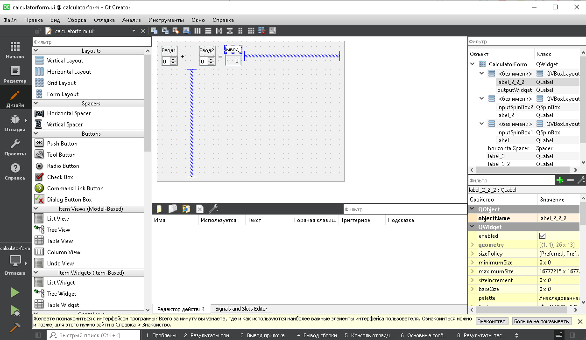

МИНИСТЕРСТВО НАУКИ  И ВЫСШЕГО ОБРАЗОВАНИЯ РОССИЙСКОЙ ФЕДЕРАЦИИ 
Федеральное государственное автономное образовательное учреждение высшего образования 
"КРЫМСКИЙ ФЕДЕРАЛЬНЫЙ УНИВЕРСИТЕТ им. В. И. ВЕРНАДСКОГО" 
ФИЗИКО-ТЕХНИЧЕСКИЙ ИНСТИТУТ 
Кафедра компьютерной инженерии и моделирования

 
<h3 align="center">Отчёт по лабораторной работе № 4  по дисциплине "Программирование"</h3>
  

студента 1 курса группы ПИ-б-о-201(2) 
Садетов Алим Асанович 
направления подготовки 09.03.04 "Программная инженерия"

  
<table>
<tr><td>Научный руководитель  старший преподаватель кафедры  компьютерной инженерии и моделирования</td>
<td>(оценка)</td>
<td>Чабанов В.В.</td>
</tr>
</table>
  

Симферополь, 2021

<h2>Постановка задачи</h2>

Настроить рабочее окружение, для разработки программного обеспечения при помощи Qt и IDE Qt Creator, а также изучить базовые возможности данного фреймворка.

<h2>Выполнение работы</h2>

### Задание 1
1. Перед выполнением этой лабораторной работы был установлен комплект Qt, включающий в себя IDE.
2. С официального сайта был скачен Qt creator (при установке также был скачен MinGW).

Рисунок 1. Установка Qt creator

3. Открываем пример проекта под названием "Calculator Form Example"
4. После этого были изменены текст форм "Input 1", "Input 2", "Output" на "Ввод 1", "Ввод 2" и "Вывод" соответственно.

Рисунок 2. Работа с редактором форм Qt Creator

### Задание 2
1. **Как изменить цветовую схему (оформление) среды?** 
Выполнить всё что ниже по порядку:
Инструменты -> Параметры -> Среда -> Интерфейс -> Тема

2. **Как закомментировать/раскомментировать блок кода средствами Qt Creator? Имеется ввиду комбинация клавиш или пункт меню.** 
С помощью комбинации:
Ctrl+/

3. **Как открыть в проводнике Windows папку с проектом средствами Qt Creator?** 
В редакторе выбрать файл (файл проекта также подойдет) -> нажать по нему ПКМ -> `Открыть в проводнике`

4. **Какое расширение файла-проекта используется Qt Creator? Может быть несколько ответов.** 
`<имя проекта>.pro` для сборщика QT 
`CMakeLists.txt` для сборщика CMake, а также файлы `*.cmake` для библиотек.

5. **Как запустить код без отладки?** 
Нажать на зелёный треугольник слева снизу или `Сборка` -> `Запустить (Ctrl+R)`

6. **Как запустить код в режиме отладки?** 
Нажать на зелёный треугольник с жучком (багом) слева снизу или `Отладка` -> `Начать отладку` -> `Начать отладку запускающего проекта (F5)`

7. **Как установить/убрать точку останова (breakpoint)?** 
Нажать слева от строки либо переместить курсор на нужную строку и нажать `Отладка` -> `Поставить/снять точку останова (F9)`

### Задание 3
**Чему равны переменные i и d в 6 строке?** 
- d = 4.7952351524781363e-317  
- i = 0

**Чему равны переменные i и d в 7 строкe?** 
- d = 4.7952351524781363e-317 
- i = 5

**Чему равны переменные i и d в 8 строке?** 
- d = 5 
- i = 5

Каталог с Заданием 3:
[[Задание 3]](./c++)

## Вывод
По ходу работы с я получил навыки работы с Qt creator, создавать в нём проект, настраивать среду, редактировать немного формы, открывать примеры проектов.